# CloudTunes

**Open source, web-based music player for the cloud.**   [[hn](https://news.ycombinator.com/item?id=8284785 "Hacker News discussion")]


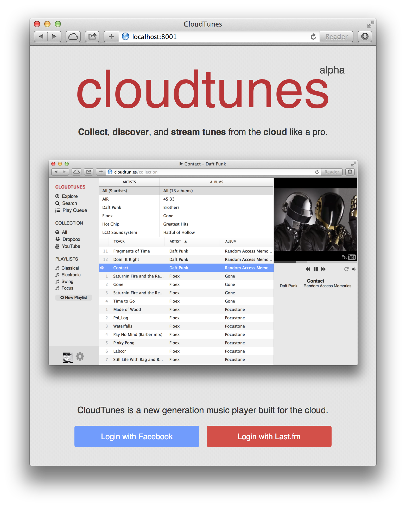


CloudTunes provides a unified interface 
for music stored in the cloud (YouTube, Dropbox, etc.) and integrates with 
[Last.fm](http://www.last.fm/api), Facebook, 
and [Musicbrainz](https://musicbrainz.org/) for metadata, discovery, 
and social experience. It is similar to services like Spotify, 
except instead of local tracks and the fixed Spotify catalog, 
CloudTunes uses your files stored in Dropbox and music videos on YouTube.


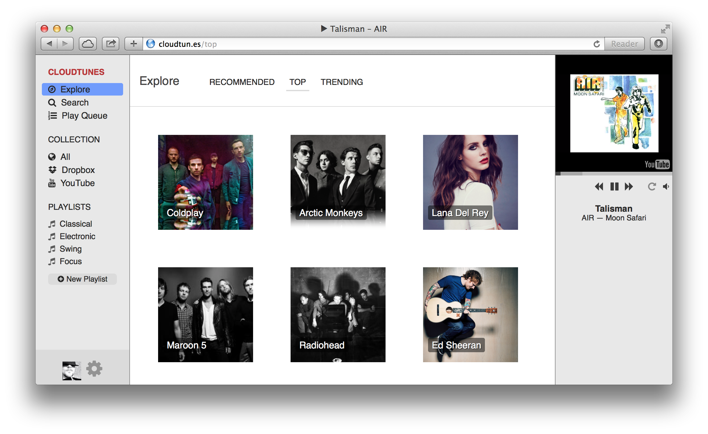
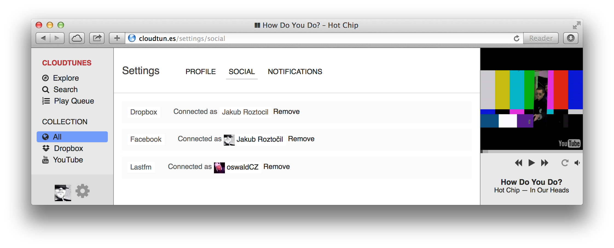


## The Story

CloudTunes is a side project of 
[@jakubroztocil](https://twitter.com/jakubroztocil) who is a bit of a 
[music nerd](http://last.fm/user/oswaldcz) and who likes to 
[build stuff](https://github.com/jakubroztocil).  In 2012 he decided 
to create an iTunes-like webapp to **make music stored all over the cloud 
easily discoverable and accessible:** hence *CloudTunes*. 

One of the goals was to experiment with a bunch of new technologies as well.
Later the side-project has been largely abandoned due to other more pressing 
projects. In the autumn of 2014 CloudTunes has been open-sourced *"as is"* 
(i.e. alpha quality, lack of polish, tests and docs).


## Technology

The architecture consist of a server and client component. Those two are 
decoupled and communicate via a JSON REST API and a WebSocket connection:


### [`cloudtunes-server`](cloudtunes-server)

**Web and WebSocket server, worker processes.**
Written in **Python,** uses Tornado, Celery, Mongo DB, MongoEngine, Redis.


### [`cloudtunes-webapp`](cloudtunes-webapp) 
**Single-page app.** Written in **CoffeeScript and Sass,** uses Brunch, 
Backbone.js, SocketIO, Handlebars, Compass, SoundManager.


## Features

### Discographies & Entire Albums

Find and stream entire albums from YouTube.

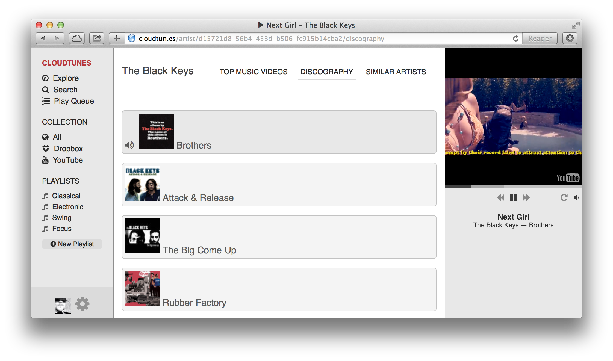
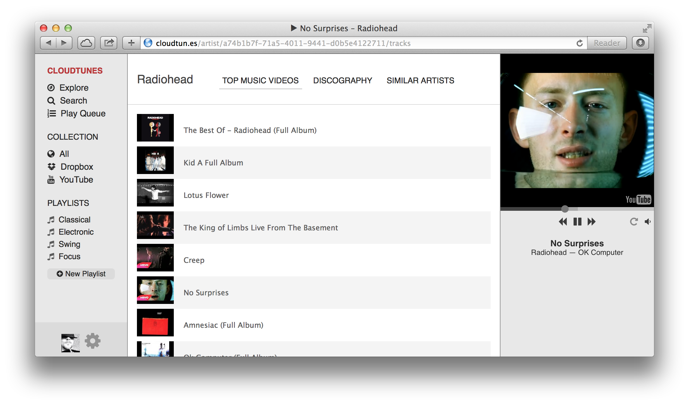
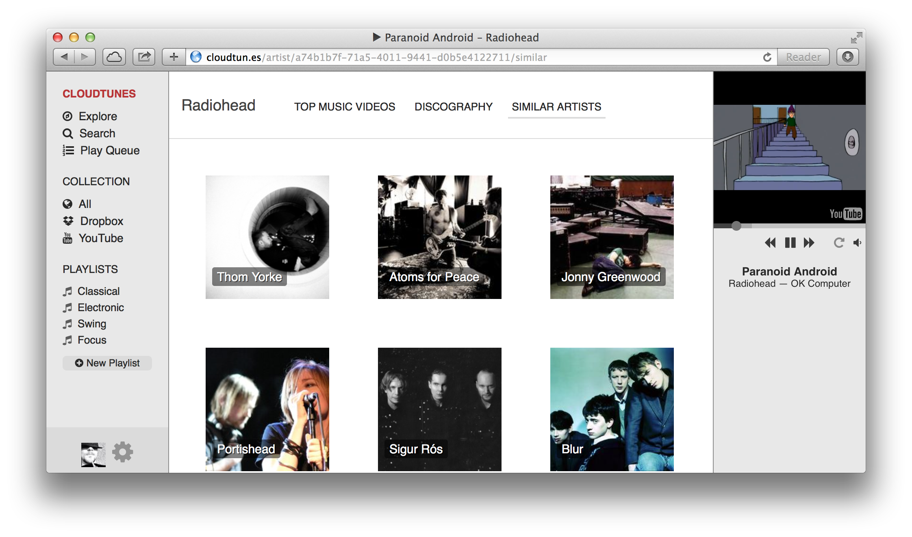
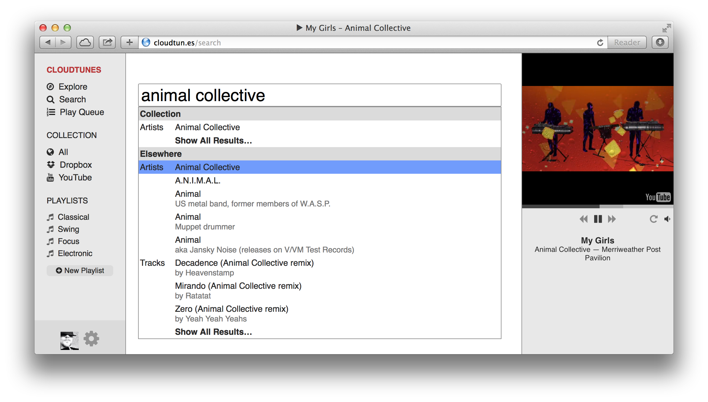

Any album or track you like can be added to your collection or any of your playlists.

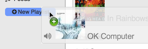


### Dropbox Integration

Access and stream **music that you already have in Dropbox** from any computer.
Fast indexing and realtime updates.
 
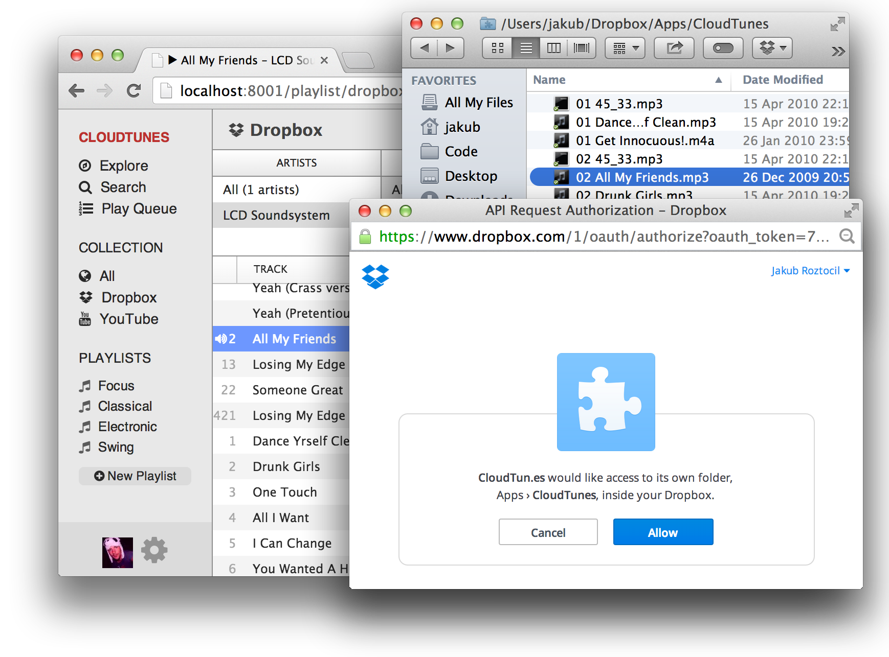


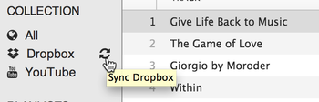


### Playlists

Organise your collection with playlists. Drag and drop tracks and 
albums on a playlist to add them. You can create playlists containing both tracks from your Dropbox and music videos from YouTube.

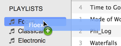
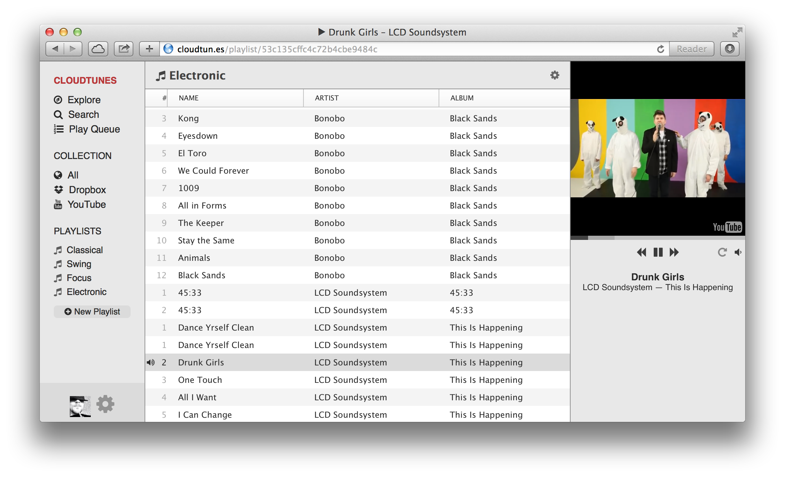


### Last.fm Support

Scrobble and play your personalised recommendations. 

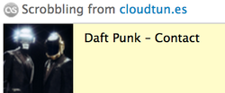
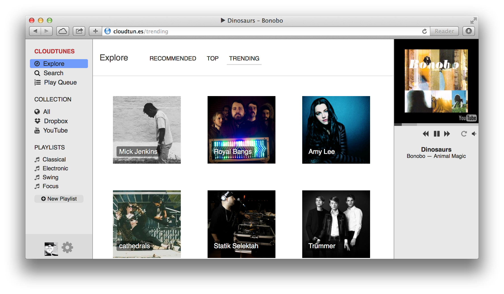


### Notifications

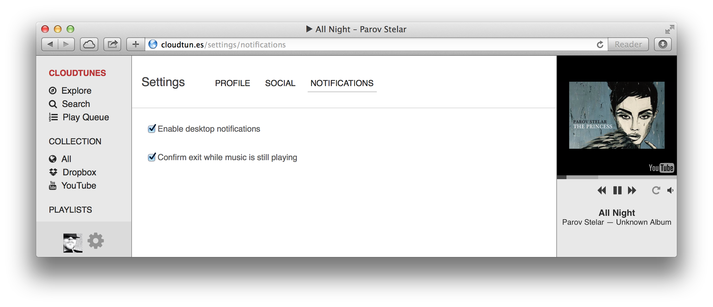
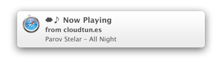
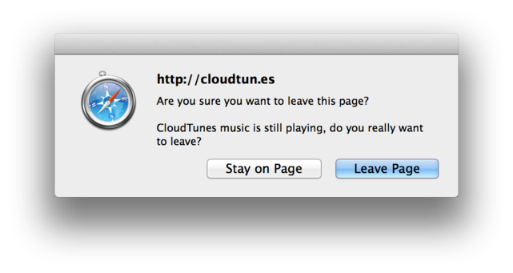

### Settings

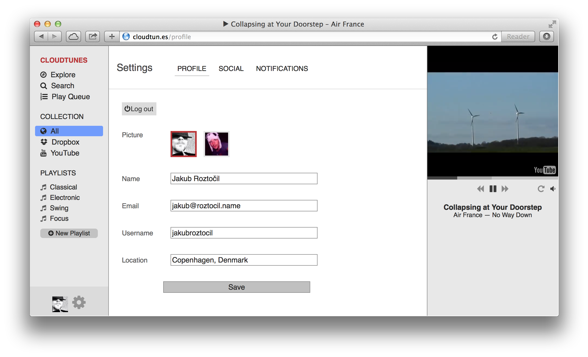


### Miscellaneous

* Drag and drop
* Keyboard shortcuts
* Browse view
* Sorting, resizing
* Support for 10s of 1000s of tracks in collection


## Installation
Clone this repository:

```bash
$ git clone git@github.com:jakubroztocil/cloudtunes.git
$ cd cloudtunes
```


### Without Docker

Continue by follow the instructions in:

* [`cloudtunes-server/README`](cloudtunes-server)
* [`cloudtunes-webapp/README`](cloudtunes-webapp)

### With Docker

The easiest way to run CloudTunes is in an isolated [Docker](https://docker.com/) container. Like this, the only thing you need to install on your system directly is Docker (or `boot2docker`) itself.

Please follow the [installation instructions](](https://docs.docker.com/installation/#installation) ) on how to install Docker (or `boot2docker`) on your system.

1.  **Build** a Docker image according to [`Dockerfile`](Dockerfile) and named `cloudtunes-img`. This will take a long time 
when run for the first time:

	```bash
	$ docker build --tag=cloudtunes-img .
	```
1. **Verify** the image been created:

	```bash
	$ docker images
	REPOSITORY          TAG                 IMAGE ID            CREATED             VIRTUAL SIZE
	cloudtunes-img      latest              e1bcb48ab148        About an hour ago   995.1 MB
	```

1. **Create** a new container named `cloudtunes ` from the `cloudtunes-img` image and run the app in it:
``` bash
$ docker run --name=cloudtunes --publish=8000:8000  --detach --tty cloudtunes-img
```

1. **Verify** the container is running:

	```bash
	$ docker ps
	CONTAINER ID        IMAGE                   COMMAND                CREATED             STATUS              PORTS                    NAMES
	564cc245e6dd        cloudtunes-img:latest   "supervisord --nodae   52 minutes ago      Up 2 minutes        0.0.0.0:8000->8000/tcp   cloudtunes

	```
	

1. Now CloudTunes should be running in the Docker container on port `8000`. The full URL depends on the method you used to install Docker:
	* If you have installed **Docker directly** on your system, the full URL will simply be: [`http://localhost:8000/`](http://localhost:8000/)
	* If you have used **`boot2docker`,** then run `$ boot2docker ip` to find out the IP address under which the app is available, and the full URL will be `http://<boot2docker IP>:8000/`

1. To stop the app (Docker container), run:
	```bash
	$ docker stop cloudtunes
	```
	To start it again, run:
	```bash
	$ docker start cloudtunes
	```
	All data will persist until you delete the container.
	
	
1. If you make any changes to the codebase or configuration, or simply want to start from scratch, run the following commands to delete the existing container (this will also delete all user data in it):
	```bash
	$ docker stop cloudtunes
	$ docker rm cloudtunes
	```

	And then start again from step 1.


## Licence

BSD. See [LICENCE](LICENCE) for more details.


## Contact 

Jakub Roztočil

* [https://github.com/jakubroztocil](https://github.com/jakubroztocil)
* [https://twitter.com/jakubroztocil](https://twitter.com/jakubroztocil)
